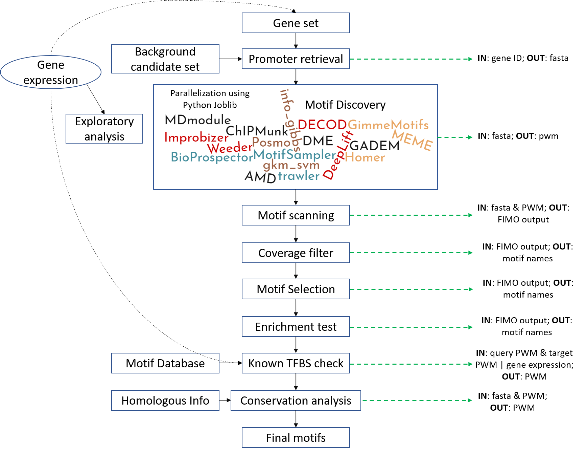

# Emotif Alpha: A multi-omic DNA motif discovery and selection pipeline

## Installation

This pipeline is developed in python 2. Should only work in Linux system.


#### 1. GimmeMotifs
GimmeMotifs is a collection of motif discovery tools. The most straightforward way to install GimmeMotifs (https://github.com/simonvh/gimmemotifs ) is:

`conda create -n motif_py2 python=2 gimmemotifs`


#### 2. DME

`git clone https://github.com/smithlabcode/dme`

`cd dme`

`https://github.com/smithlabcode/smithlab_cpp.git`

`module load gcc/6.3.0` (specifically for stjude HPC)

`make`

`./dme2` (you should be able to see the help message)

Next, add dme2 to your env var.

`export PATH=$PATH:/PATH_TO_DME2/`


#### 3. biopython sklearn joblib

Sometimes installing a python package can upgrade your python 2 to python 3 automatically, be aware what is installed.

`conda install -c anaconda biopython`

`conda install -c anaconda scikit-learn`

`conda install -c anaconda joblib`

`conda install -c bioconda genomepy`

`genomepy install hg19 UCSC --annotation`

#### 4. install Emotif

`git clone https://github.com/YichaoOU/Emotif_Alpha.git`

`cd Emotif_Alpha`

Note that you should be in the conda env where you have all the required library installed, e.g., motif_py2

`python setup.py install`


## Example Usage:


1. Copy a sample configuration file

```
Emotif_alpha -copy
```

2. Run motif discovery ensemble

```
Emotif_alpha -f sample.md
```

By default, the jobID (i.e., a folder that contains all motif discovery results) is `[Username]_Emotif_alpha_[Date]`


## Other Dependencies


(1)	R ggplot2 (https://github.com/hadley/ggplot2 )

(2)	MEME suite (http://meme-suite.org/doc/install.html?man_type=web )
You will use meme, meme2images, fimo, and mast.

(3) JAVA, to run DECOD

## FAQ:
(1) wrong GimmeMotifs command?
Depends on the GimmeMotifs version, the command in the motif_discovery.py may not be correct.
(2) can't find dme2 command?
Please put the dme2 in your $PATH. 

## High-level Workflow


