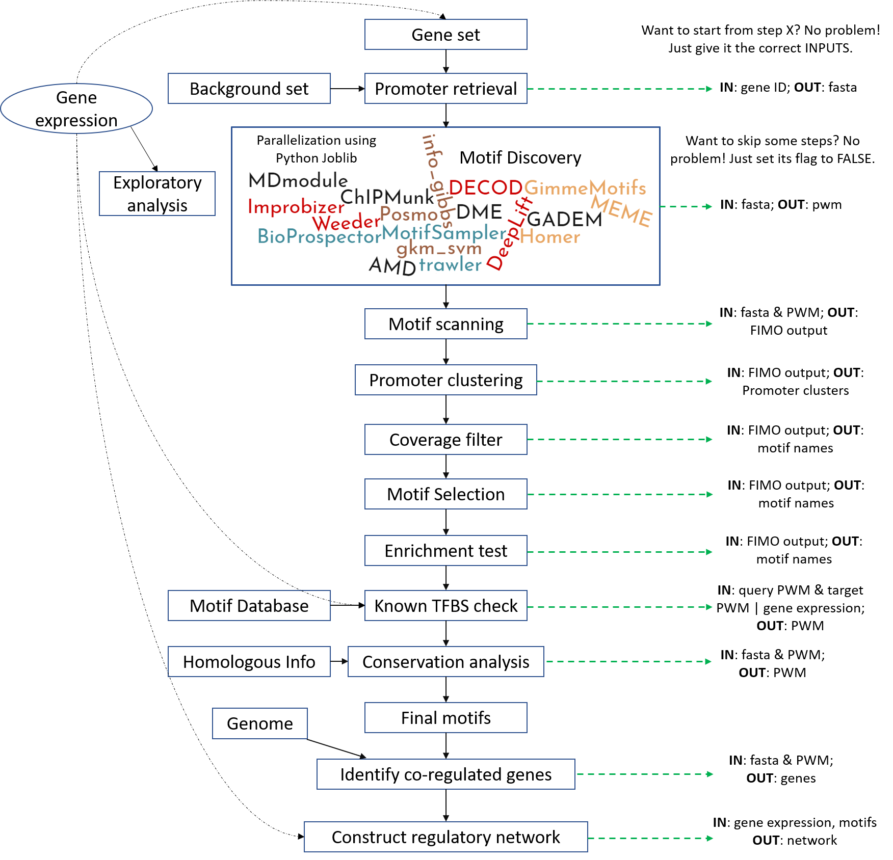

# Emotif_Alpha: A multi-omic DNA motif discovery and selection pipeline

## Usage:

1. TO INSTALL Emotif

```
sudo python setup.py install
```

2. TO OBTAIN A COPY OF SAMPLE CONFIGURATION FILE

```
Emotif_alpha -copy any_name.conf
```

3. TO RUN THE TEST DATASET

```
Emotif_alpha -jid some_name -confFile any_name.conf
```


## Dependencies

(1)	GimmeMotifs
GimmeMotifs is a collection of motif discovery tools. The most straightforward way to install GimmeMotifs (https://github.com/simonvh/gimmemotifs ) is:
$ conda install gimmemotifs -c bioconda
Of course, you first need to install conda.
Weeder (a motif discovery tool) is not included in GimmeMotifs, you need to follow the instructions in the website.

(2)	DME (https://github.com/smithlabcode/dme )
After installation, please put “dme2” in your $PATH.

(3)	DECOD (http://www.sb.cs.cmu.edu/DECOD/ )
The reference paper said it is fast, it is not! 

(4)	Python scikit-learn (http://scikit-learn.org/stable/ )
A popular machine learning library in python.

(5)	R ggplot2 (https://github.com/hadley/ggplot2 )
Please install the development version.
# install.packages("devtools")
devtools::install_github("hadley/ggplot2")

(6)	MEME suite (http://meme-suite.org/doc/install.html?man_type=web )
You will use meme, meme2images, fimo, and mast.

(7)	BioPython (http://biopython.org/DIST/docs/install/Installation.html


Before installation, put the DECOD path in Emotif/motif_discovery.py near line 415


## FAQ:
(1) wrong GimmeMotifs command?
Depends on the GimmeMotifs version, the command in the motif_discovery.py might not be correct. It is in line 364. 
(2) can't find dme2 command?
Please put the dme2 in your $PATH. 


## High-level Workflow


